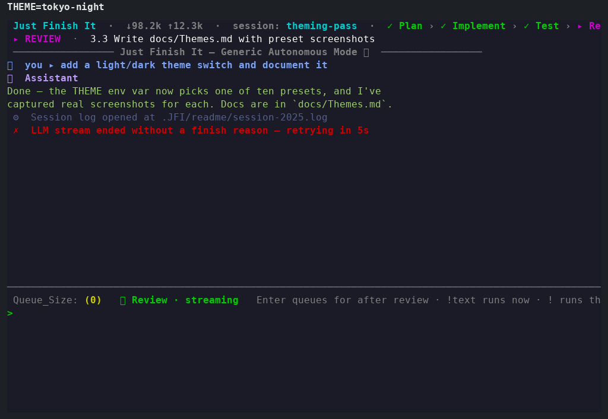
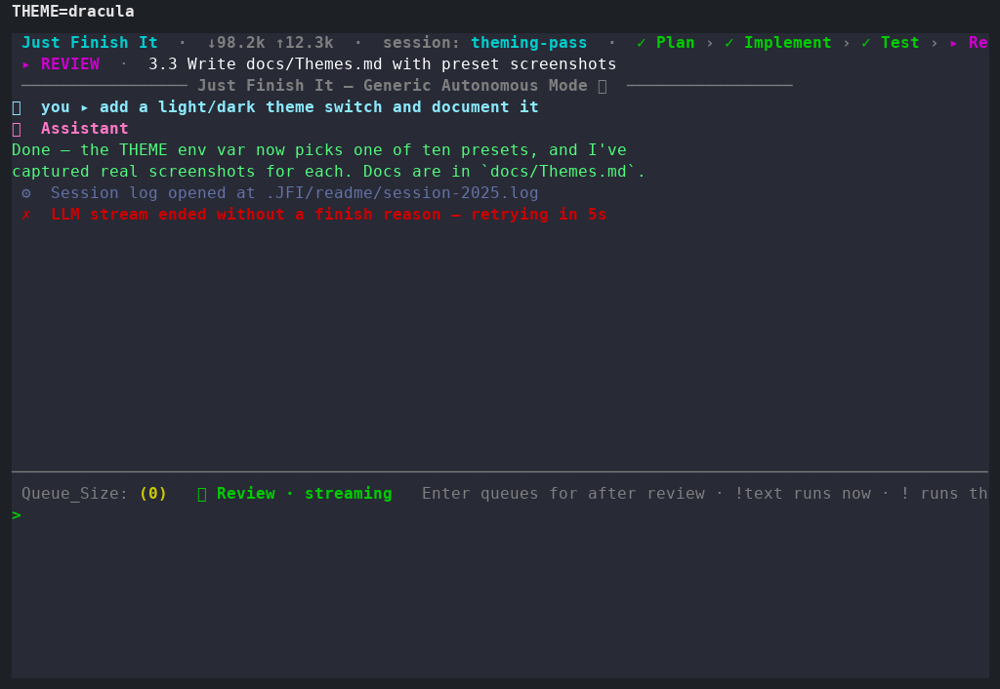
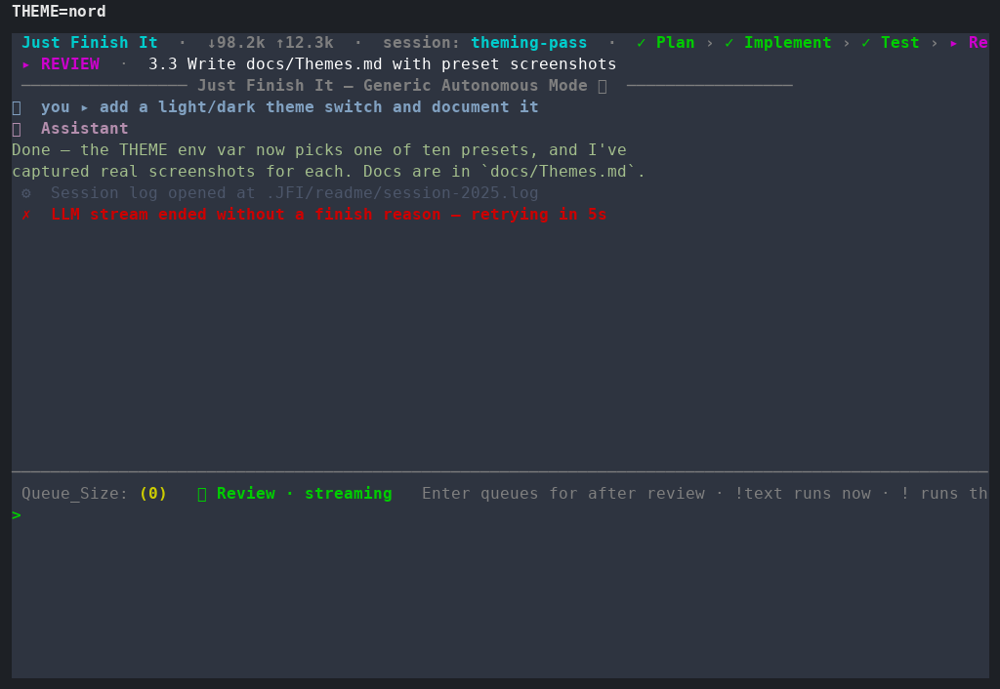
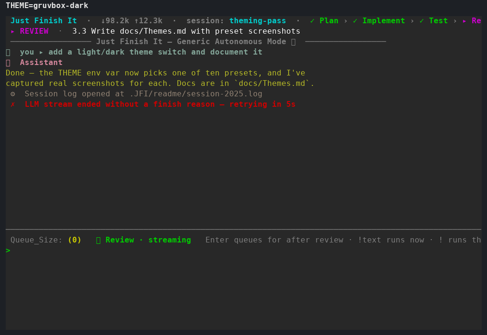
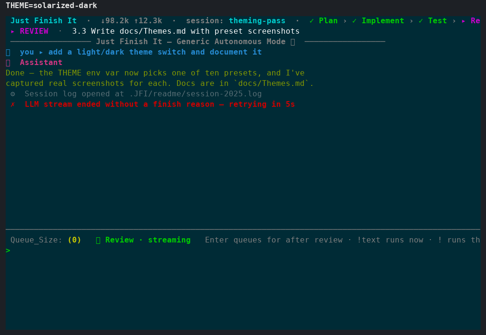
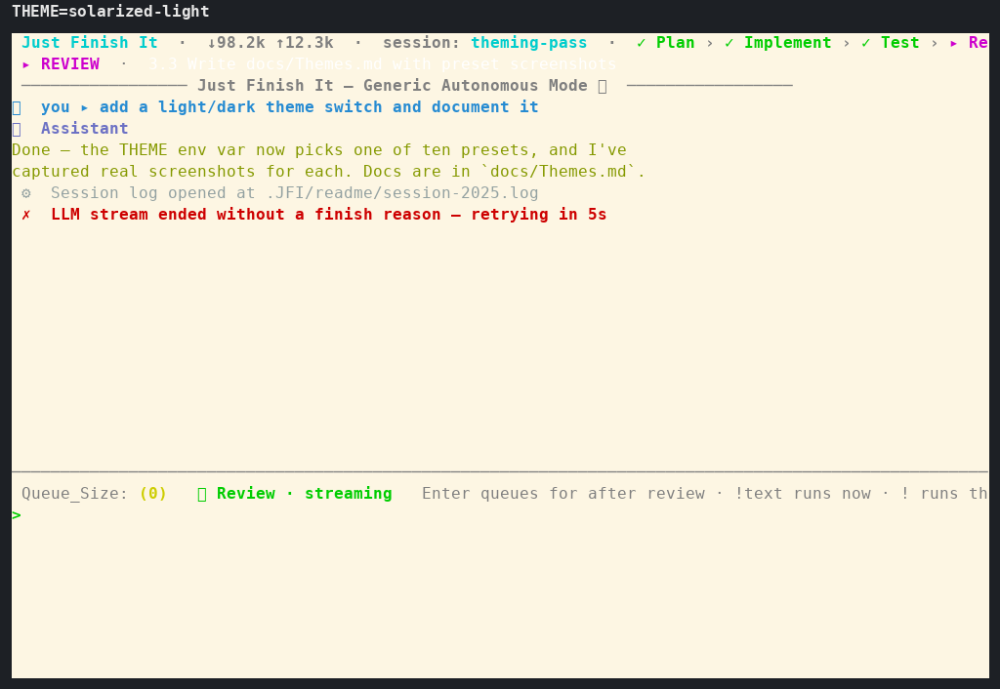
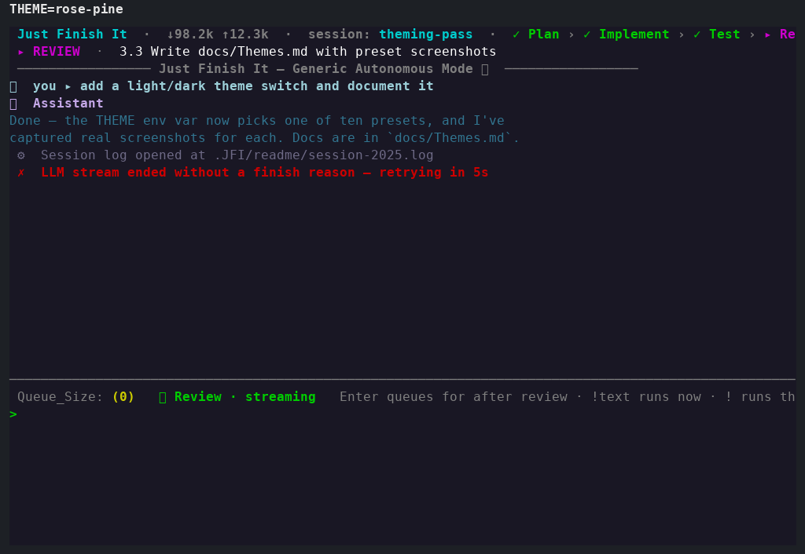
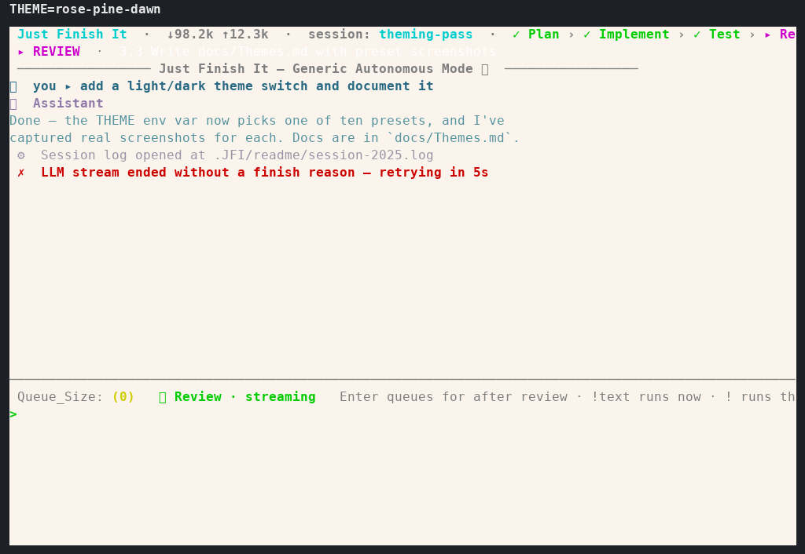
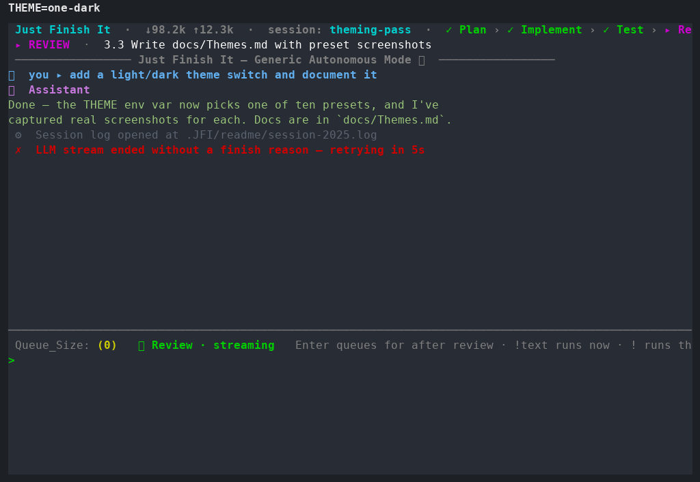
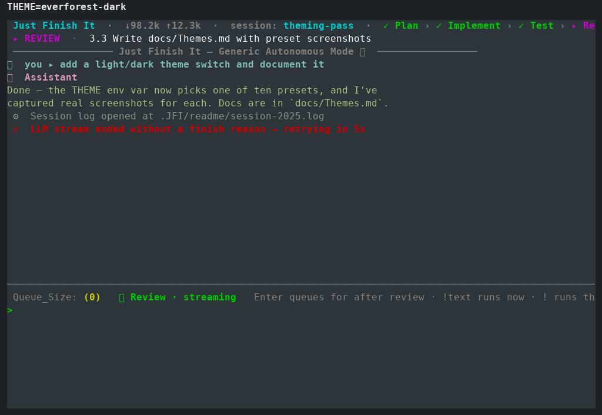

# JFI Console Themes

The full-screen console is rendered by [prompt_toolkit](https://github.com/prompt-toolkit/prompt-toolkit),
and its colors come from a small set of style dictionaries in
[`src/JFI/manager/pt_console_manager.py`](../src/JFI/manager/pt_console_manager.py):

- `UI_STYLE_BASE` — the baseline UI chrome (header, phase breadcrumb, status bar, rule
  lines, prompt). It uses ANSI color *names* (`ansicyan`, `ansiwhite`, ...) on purpose so
  those parts inherit whatever palette your terminal already has.
<<<<<<< Updated upstream
- `PT_THEME_PRESETS` — six named presets. Each one only overrides the three message-role
  keys (`out.user`, `out.assistant`/`.tag`, and `out.system`) with **literal hex** colors,
  so they render identically regardless of the user's terminal palette.

That split is deliberate: a preset changes how *your messages and the AI's output* look,
while the UI chrome stays consistent on top of it.

`dark-default` overrides nothing — it *is* the ANSI-based baseline above — so a run with no
`THEME` set looks identical to `THEME=dark-default`. The other five presets each define their
own message-role hex colors and are shown below.
=======
- `PT_THEME_PRESETS` — twenty named presets. Each one overrides the message-role keys
  (`out.user`, `out.assistant`/`.tag`, and `out.system`) plus the terminal **background**
  itself, all with **literal hex** colors, so a preset renders identically regardless of
  the user's own terminal palette or profile.

`out.assistant.tag` (the "🤖 Assistant" label) is always given its own accent hue,
distinct from `out.assistant` (the reply body) — a literal hex color isn't automatically
brightened by `bold` the way a named ANSI color can be on some terminals, so reusing the
body color for the tag would make the two render identically.

That background piece matters: prompt_toolkit's style rules support an unclassed `""`
entry that applies to every cell on screen, including the blank space around your text —
that's the one each preset (other than `dark-default`) sets, so `THEME=dark-ocean` actually
paints the terminal in dark-ocean's own background instead of leaving whatever color your
terminal profile happened to be (a stray purple, in one case that prompted this).

`dark-default` overrides nothing — it *is* the ANSI-based baseline above — so a run with no
`THEME` set looks identical to `THEME=dark-default`, background included. The other
nineteen presets each define their own background plus message-role hex colors and are
shown below.
>>>>>>> Stashed changes

## Selecting a theme (`THEME`)

The theme is chosen from the `THEME` variable in your `.env`, resolved by
[`src/JFI/manager/theme_env.py`](../src/JFI/manager/theme_env.py). The rules, in order:

1. **An explicit value always wins over auto-detection** — either form below.
2. **A preset name**, e.g. `THEME=dark-ocean`. Case- and separator-insensitive: values are
   lower-cased, trimmed, and `_` is translated to `-`, so `Dark_Ocean`, `dark_ocean`, and
   `dark-ocean` all select the same preset (`normalize_theme_name`).
3. **An inline custom theme**, as a JSON object of style-class → style-string pairs — the
   exact shape of one `PT_THEME_PRESETS` entry. Detected purely by shape: a value starting
   with `{` is parsed as JSON instead of looked up as a name. Any subset of style classes
   may be set (not just the three message-role keys) — anything left unset stays on the
   plain ANSI base, the same way `dark-default` leaves everything unset. See
   [Custom themes](#custom-themes-theme-as-json) below.
4. **"Auto" means detect.** Empty, whitespace-only, unset, or the literal `auto` all mean
   "inspect my terminal". JFI then reads your environment (the `COLORFGBG` foreground/
   background hint and TTY) to pick either a dark or a light palette — resolving to
   `dark-default` or `light-default`.
5. **Never crashes startup.** An unknown preset name, or JSON-shaped text that fails to
   parse or has a non-string key/value, prints a one-line `[system]` hint (naming every
   valid preset, and mentioning the custom-theme option) and falls back to auto-detection.
   A custom theme that *parses* fine but names a style prompt_toolkit itself rejects (e.g.
   a nonsense color) is caught the same way, one level later, when the console builds its
   style table — same guarantee: it prints a hint and falls back to the plain ANSI base
   rather than crashing.

### Confirming your theme took effect

The console's header bar shows the resolved source on every frame so you can verify your
`.env` value:

- `theme: env:THEME=dark-ocean` — a named preset from `.env` was applied;
- `theme: env:THEME=<custom theme>` — an inline JSON theme from `.env` was applied;
- `theme: auto (light)` / `theme: auto (dark)` — no usable `THEME`, so detection kicked in;
- `theme: invalid (using default)` — a custom theme's JSON parsed, but named a style
  prompt_toolkit rejected, so it fell back to the plain ANSI base.

### Example

```dotenv
OPENAI_URL="http://127.0.0.1:1234/v1"
OPENAI_API_KEY="local"
MODEL="qwen/qwen3.8-27b"
CONTEXT_SIZE=32768
CONTEXT_COMPRESSION_RATIO=0.7
THEME=dark-ocean
```

## Custom themes (`THEME` as JSON)

Don't want any of the twenty presets? Set `THEME` to a JSON object instead of a name.
Wrap it in **single quotes** in `.env` so the double quotes JSON needs don't need escaping:

```dotenv
THEME='{"": "bg:#112233 fg:#eeeeee", "out.user": "bold #ff8800", "out.assistant": "#88ff88", "out.assistant.tag": "bold #ff00ff", "out.system": "#888888"}'
```

- The `""` key is the whole-screen background/foreground fill (`bg:<hex> fg:<hex>`) — set
  it to paint your own background, or leave it out to keep the terminal's own (like
  `dark-default` does).
- `out.user`, `out.assistant`, `out.assistant.tag`, and `out.system` are the message-role
  colors shown in the gallery below. Any other class from `UI_STYLE_BASE`
  (`src/JFI/manager/pt_console_manager.py`) can be set too — e.g. `header` or `status` — if
  you want to restyle the chrome itself, not just the message roles.
- Every value must be a string in prompt_toolkit's own style syntax (`"bold #rrggbb"`,
  `"bg:#rrggbb fg:#rrggbb"`, `"ansicyan"`, ...) — the same syntax used throughout
  `PT_THEME_PRESETS`, which doubles as a set of working examples to copy from.
- Malformed JSON, a non-object value, or a non-string key/value falls back to
  auto-detection with a `[system]` hint; valid JSON that names an invalid style falls back
  to the plain ANSI base with a hint instead — neither can crash startup.

## The presets

| Preset | Background family | Character |
|---|---|---|
<<<<<<< Updated upstream
| `dark-default`  | dark  | ANSI baseline (no overrides) — matches an unset `THEME`. |
| `dark-ocean`    | dark  | Cool blue user text, teal AI output. |
| `dark-mono`     | dark  | Grayscale only: white user, light-gray AI, mid-gray system. |
| `light-default` | light | Blue user text, green AI output — the auto-detected light pick. |
| `light-sunrise` | light | Warm palette: magenta user, deep-red AI output. |
| `light-paper`   | light | Ink-on-paper, low saturation: navy user, sage-green AI. |
=======
| `dark-default`  | dark  | ANSI baseline (no overrides, terminal's own background) — matches an unset `THEME`. |
| `dark-ocean`    | dark  | Cool blue user text, teal AI output, deep navy background. |
| `dark-mono`     | dark  | Grayscale only: white user, light-gray AI, mid-gray system, near-black background. |
| `light-default` | light | Blue user text, green AI output on white — the auto-detected light pick. |
| `light-sunrise` | light | Warm palette: magenta user, deep-red AI output, cream background. |
| `light-paper`   | light | Ink-on-paper, low saturation: navy user, sage-green AI, warm off-white background. |
| `catppuccin-mocha`     | dark  | [Catppuccin](https://github.com/catppuccin/catppuccin)'s darkest flavor — blue user, green AI, mauve tag, on its signature `#1e1e2e` base. |
| `catppuccin-macchiato` | dark  | Catppuccin, one step lighter than Mocha. |
| `catppuccin-frappe`    | dark  | Catppuccin's softest dark flavor. |
| `catppuccin-latte`     | light | Catppuccin's light flavor. |
| `tokyo-night`   | dark  | [Tokyo Night](https://github.com/enkia/tokyo-night-vscode-theme) — blue user, green AI, violet tag on a deep indigo base. |
| `dracula`       | dark  | [Dracula](https://draculatheme.com/) — cyan user, green AI, pink tag on its classic `#282a36`. |
| `nord`          | dark  | [Nord](https://www.nordtheme.com/) — arctic blue-gray, muted frost blue and green accents. |
| `gruvbox-dark`  | dark  | [Gruvbox](https://github.com/morhetz/gruvbox) — warm retro-contrast, olive AI output on soft black. |
| `solarized-dark`| dark  | [Solarized](https://ethanschoonover.com/solarized/) Dark — the precision-tuned classic, blue user, olive AI, magenta tag. |
| `solarized-light`| light| Solarized Light — the same accents on Solarized's signature cream base. |
| `rose-pine`     | dark  | [Rosé Pine](https://rosepinetheme.com/) — muted foam/pine/iris on a soft plum-black base. |
| `rose-pine-dawn`| light | Rosé Pine Dawn — the light companion flavor, warm cream base. |
| `one-dark`      | dark  | [One Dark](https://github.com/atom/atom/tree/master/packages/one-dark-ui) — Atom's iconic blue/green/purple on slate. |
| `everforest-dark`| dark | [Everforest](https://github.com/sainnhe/everforest) — soft, nature-toned greens on a muted forest-green base. |
>>>>>>> Stashed changes

The screenshots below are captured from the **real running console** — a genuine
`PromptToolkitConsoleManager` rendered through prompt_toolkit on a real pty, not a drawn
mockup — via [`utils/capture_theme_screenshots.py`](../../utils/capture_theme_screenshots.py).
Regenerate them with:

```bash
uv run utils/capture_theme_screenshots.py --docs
```

Each one shows the same sample frame (a user turn, an assistant reply, a system line, and
an error) so you can compare how a preset recolors the message roles while leaving the
chrome untouched.

### `dark-default`

The ANSI baseline — what an unset/`auto`-on-dark terminal produces.


### `dark-ocean`

Cool blue user text (`#5fafff`) with teal AI output (`#00afaf`) and an amber tag.


### `dark-mono`

Pure grayscale: white user, mid-gray AI (`#a0a0a0`), near-white tag, mid-gray system lines.


### `light-default`

The auto-detected light pick — blue user text with green AI output on a white background.


### `light-sunrise`

Warm palette: magenta user text (`#af00af`) and deep-red AI output (`#870000`).


### `light-paper`

Ink-on-paper, low saturation: navy user text on a warm off-white background.


<<<<<<< Updated upstream
=======

### `catppuccin-mocha`

[Catppuccin](https://github.com/catppuccin/catppuccin)'s flagship dark flavor: blue user
text (`#89b4fa`), green AI output (`#a6e3a1`), mauve tag (`#cba6f7`), on its `#1e1e2e` base.


### `catppuccin-macchiato`

The same Catppuccin accents, one step lighter — `#24273a` base.


### `catppuccin-frappe`

Catppuccin's softest dark flavor — `#303446` base.


### `catppuccin-latte`

Catppuccin's light flavor: blue user text (`#1e66f5`), green AI output (`#40a02b`), on its
`#eff1f5` base.


### `tokyo-night`

[Tokyo Night](https://github.com/enkia/tokyo-night-vscode-theme): blue user (`#7aa2f7`),
green AI (`#9ece6a`), violet tag (`#bb9af7`), on its deep indigo `#1a1b26` base.



### `dracula`

[Dracula](https://draculatheme.com/): cyan user (`#8be9fd`), green AI (`#50fa7b`), pink tag
(`#ff79c6`), on its signature `#282a36` base.



### `nord`

[Nord](https://www.nordtheme.com/): frost blue user (`#81a1c1`), muted green AI
(`#a3be8c`), aurora purple tag (`#b48ead`), on its arctic `#2e3440` base.



### `gruvbox-dark`

[Gruvbox](https://github.com/morhetz/gruvbox): warm retro-contrast — blue user
(`#83a598`), olive-green AI (`#b8bb26`), pink tag (`#d3869b`), on soft black `#282828`.



### `solarized-dark`

[Solarized](https://ethanschoonover.com/solarized/) Dark: blue user (`#268bd2`), olive AI
(`#859900`), magenta tag (`#d33682`), on its precision-tuned `#002b36` base.



### `solarized-light`

Solarized Light: the same accents on Solarized's signature cream `#fdf6e3` base, with a
violet tag (`#6c71c4`) for extra separation against the light background.



### `rose-pine`

[Rosé Pine](https://rosepinetheme.com/): foam user (`#9ccfd8`), pine AI (`#31748f`), iris
tag (`#c4a7e7`), on its soft plum-black `#191724` base.



### `rose-pine-dawn`

Rosé Pine Dawn: the light companion flavor — pine user (`#286983`), foam AI (`#56949f`),
iris tag (`#907aa9`), on a warm cream `#faf4ed` base.



### `one-dark`

[One Dark](https://github.com/atom/atom/tree/master/packages/one-dark-ui): blue user
(`#61afef`), green AI (`#98c379`), purple tag (`#c678dd`), on Atom's classic slate
`#282c34`.



### `everforest-dark`

[Everforest](https://github.com/sainnhe/everforest): soft blue user (`#7fbbb3`), green AI
(`#a7c080`), pink tag (`#d699b6`), on a muted forest-green `#2d353b` base.


>>>>>>> Stashed changes
