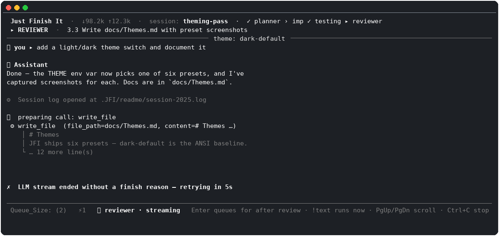
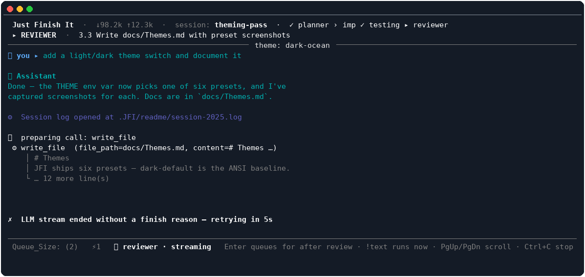
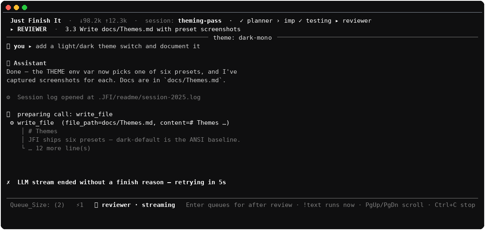
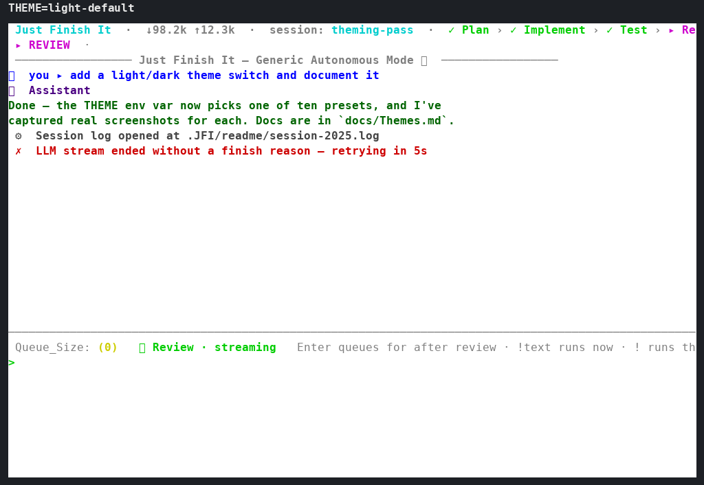
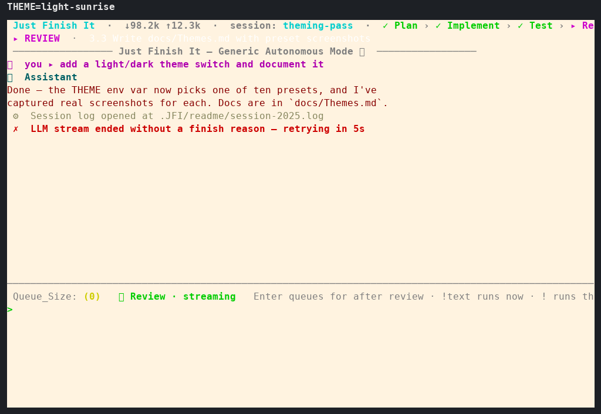
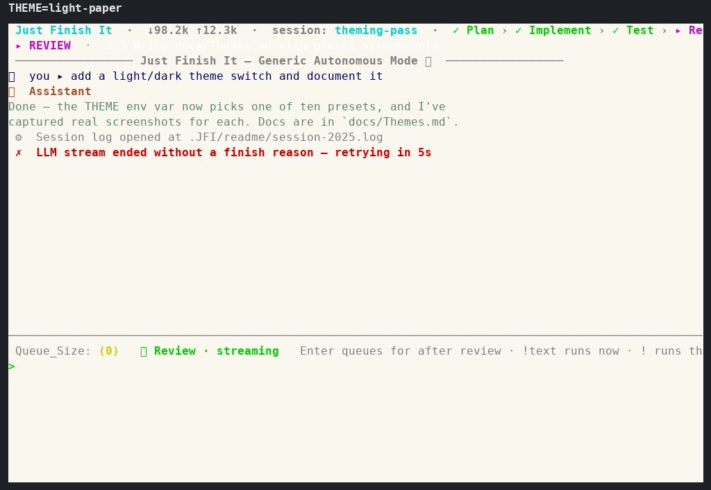
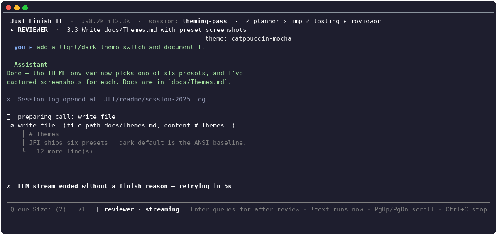
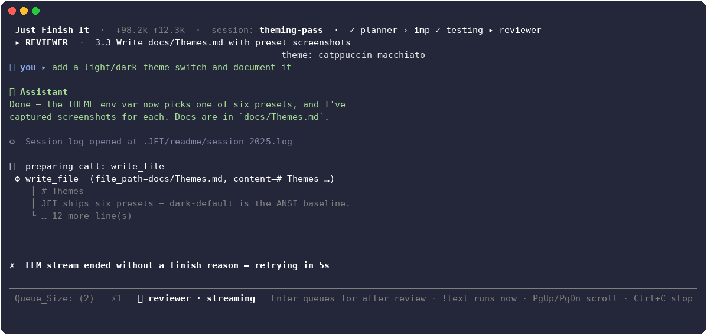
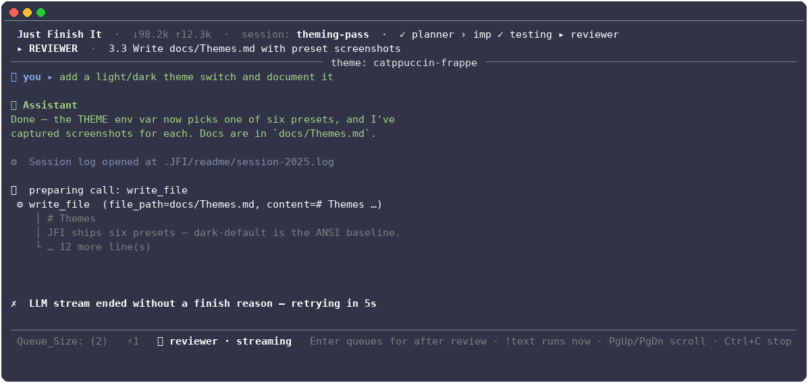
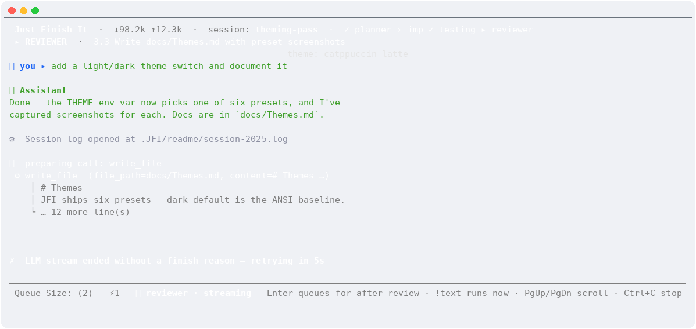

# JFI Console Themes

The full-screen console is rendered by [prompt_toolkit](https://github.com/prompt-toolkit/prompt-toolkit),
and its colors come from a small set of style dictionaries in
[`src/JFI/manager/pt_console_manager.py`](../src/JFI/manager/pt_console_manager.py):

- `UI_STYLE_BASE` — the baseline UI chrome (header, phase breadcrumb, status bar, rule
  lines, prompt). It uses ANSI color *names* (`ansicyan`, `ansiwhite`, ...) on purpose so
  those parts inherit whatever palette your terminal already has.
- `PT_THEME_PRESETS` — ten named presets. Each one overrides the three message-role keys
  (`out.user`, `out.assistant`/`.tag`, and `out.system`) plus the terminal **background**
  itself, all with **literal hex** colors, so a preset renders identically regardless of
  the user's own terminal palette or profile.

That background piece matters: prompt_toolkit's style rules support an unclassed `""`
entry that applies to every cell on screen, including the blank space around your text —
that's the one each preset (other than `dark-default`) sets, so `THEME=dark-ocean` actually
paints the terminal in dark-ocean's own background instead of leaving whatever color your
terminal profile happened to be (a stray purple, in one case that prompted this).

`dark-default` overrides nothing — it *is* the ANSI-based baseline above — so a run with no
`THEME` set looks identical to `THEME=dark-default`, background included. The other nine
presets each define their own background plus message-role hex colors and are shown below.

## Selecting a theme (`THEME`)

The theme is chosen from the `THEME` variable in your `.env`, resolved by
[`src/JFI/manager/theme_env.py`](../src/JFI/manager/theme_env.py). The rules, in order:

1. **Explicit preset wins.** A known preset name in `.env` always beats auto-detection.
2. **"Auto" means detect.** Empty, whitespace-only, unset, or the literal `auto` all mean
   "inspect my terminal". JFI then reads your environment (the `COLORFGBG` foreground/
   background hint and TTY) to pick either a dark or a light palette — resolving to
   `dark-default` or `light-default`.
3. **Case- and separator-insensitive.** Values are lower-cased, trimmed, and `_` is
   translated to `-`. So `Dark_Ocean`, `dark_ocean`, and `dark-ocean` all select the same
   preset (`normalize_theme_name`).
4. **Unknown names never crash startup.** A non-auto name that matches no preset prints a
   one-line `[system]` hint listing the valid presets, then falls back to auto-detection.

### Confirming your theme took effect

The console's header bar shows the resolved source on every frame so you can verify your
`.env` value:

- `theme: env:THEME=dark-ocean` — an explicit preset from `.env` was applied;
- `theme: auto (light)` / `theme: auto (dark)` — no usable `THEME`, so detection kicked in.

### Example

```dotenv
OPENAI_URL="http://127.0.0.1:1234/v1"
OPENAI_API_KEY="local"
MODEL="qwen/qwen3.8-27b"
CONTEXT_SIZE=32768
CONTEXT_COMPRESSION_RATIO=0.7
THEME=dark-ocean
```

## The presets

| Preset | Background family | Character |
|---|---|---|
| `dark-default`  | dark  | ANSI baseline (no overrides, terminal's own background) — matches an unset `THEME`. |
| `dark-ocean`    | dark  | Cool blue user text, teal AI output, deep navy background. |
| `dark-mono`     | dark  | Grayscale only: white user, light-gray AI, mid-gray system, near-black background. |
| `light-default` | light | Blue user text, green AI output on white — the auto-detected light pick. |
| `light-sunrise` | light | Warm palette: magenta user, deep-red AI output, cream background. |
| `light-paper`   | light | Ink-on-paper, low saturation: navy user, sage-green AI, warm off-white background. |
| `catppuccin-mocha`     | dark  | [Catppuccin](https://github.com/catppuccin/catppuccin)'s darkest flavor — blue user, green AI, on its signature `#1e1e2e` base. |
| `catppuccin-macchiato` | dark  | Catppuccin, one step lighter than Mocha. |
| `catppuccin-frappe`    | dark  | Catppuccin's softest dark flavor. |
| `catppuccin-latte`     | light | Catppuccin's light flavor. |

The screenshots below are rendered from those exact style dictionaries by
[`docs/make_theme_screenshots.py`](make_theme_screenshots.py) (run it with
`.venv/bin/python docs/make_theme_screenshots.py` to regenerate). Each one shows the same
session frame so you can compare how a preset recolors the message roles while leaving the
chrome untouched.

### `dark-default`

The ANSI baseline — what an unset/`auto`-on-dark terminal produces.



### `dark-ocean`

Cool blue user text (`#5fafff`) with teal AI output (`#00afaf`).



### `dark-mono`

Pure grayscale: white user, light-gray AI (`#d0d0d0`), mid-gray system lines.



### `light-default`

The auto-detected light pick — blue user text with green AI output on a white background.



### `light-sunrise`

Warm palette: magenta user text (`#af00af`) and deep-red AI output (`#870000`).



### `light-paper`

Ink-on-paper, low saturation: navy user text on a warm off-white background.



### `catppuccin-mocha`

[Catppuccin](https://github.com/catppuccin/catppuccin)'s flagship dark flavor: blue user
text (`#89b4fa`), green AI output (`#a6e3a1`), on its `#1e1e2e` base.



### `catppuccin-macchiato`

The same Catppuccin accents, one step lighter — `#24273a` base.



### `catppuccin-frappe`

Catppuccin's softest dark flavor — `#303446` base.



### `catppuccin-latte`

Catppuccin's light flavor: blue user text (`#1e66f5`), green AI output (`#40a02b`), on its
`#eff1f5` base.


