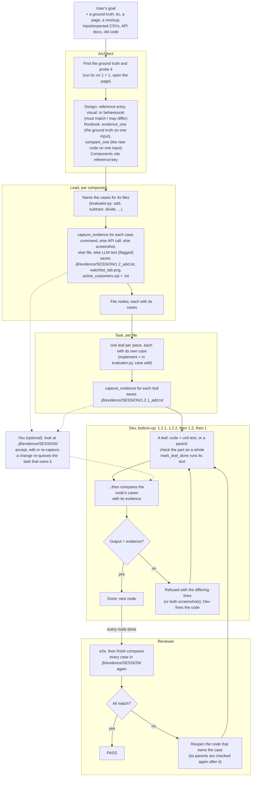
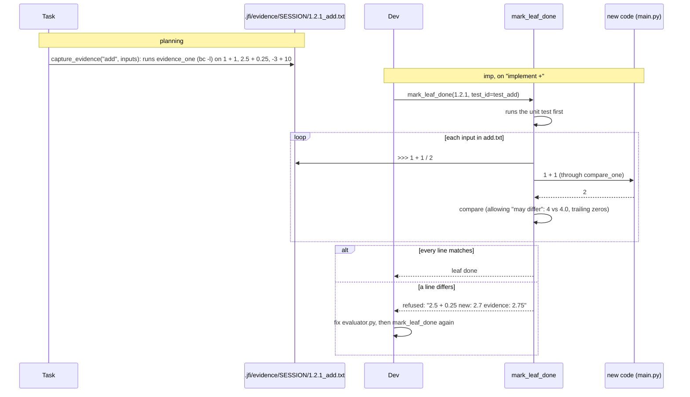

# Old vs new: evidence from a ground truth, checked on every task

**Status:** built (branch `feature/screenshots`). Code: `src/JFI/tool/evidence_tools.py`
(capture, compare, screenshots), `planner/nodes.py` and `planner/loop.py`
(`cases`, each layer's `finish`), `imp/queue.py` (bottom-up) and `imp/dev.py`
(every node's gate), `review/__init__.py`, `runner._evidence_review`, and the
Evidence list in `web/dashboard.py`. Tests: `test/test_evidence.py`. What
differs from the proposal, and what isn't built, is under "Decisions" at the
end.

## The idea

Many goals come with a **ground truth**: something the new code has to match.
It might be a command (`bc`), the original HTML page, a screenshot or mockup,
an input file with its expected output, API docs, or the old program being
replaced.

When a goal has one, each planning layer adds its own part, the way it already
plans the work:

1. **The Architect** adds to the runbook how to capture evidence from the
   ground truth and how to compare against it.
2. **The Lead** captures the **evidence** for its component: it runs the
   ground truth and saves what it gives in `.jfi/evidence/<session>/`. That's a text file
   showing that `bc` says `1 + 1 = 2`, the API's response JSON, a SQL query
   with its result, or a screenshot of the original page. It comes from a
   command, an API call or a screenshot; text generated by the LLM is the
   last resort, and is labelled as such.
   **You can look at `.jfi/evidence/<session>/`** and confirm it, edit it, or have it
   captured again, before or while the code is built.
3. **Task** creates the tasks, and captures the evidence for each one
   (`implement add` gets `1.2.1_add.txt`).
4. **Dev** works bottom-up: the leaves (1.2.1, 1.2.2), then their file (1.2),
   then the component (1). **Every task is compared with its own evidence
   when it's done**, and is done only when the new code's output matches.
   There's no separate compare task.
5. **The reviewer** runs every comparison again at the end.

Every role leaves evidence: the Architect's component, the Lead's file and
Task's leaf each have their own case(s). (Until 2026-10-06 Task added a
separate `compare` leaf per case and only the Lead's files had cases; the
user's call after the first real run: "you need to create evidence for all.
There need not be a sub point to validate against evidence.")

For the calculator, Task (evaluator.py) adds `implement +` and runs `bc` for
it:

```
.jfi/evidence/<session>/1.2.1_add.txt
# case: add
# source: command { echo scale=10; cat {input_file}; } | bc -l
# how: { echo scale=10; cat {input_file}; } | bc -l
# match: tokens
# captured: 2026-10-06 00:05 UTC by task
>>> 1 + 1
2
>>> 2.5 + 0.25
2.75
>>> -3 + 10
7
```

| # | Task | Done when |
|---|---|---|
| 1.2.1 | implement `evaluate()` for + in `evaluator.py`, case `add` | its unit test passes, then every input of `1.2.1_add.txt` gives the same answer from the new code |

Dev builds it, and `mark_leaf_done` runs the test and then the comparison:

```
compare add  (.jfi/evidence/<session>/1.2.1_add.txt, source: command { echo scale=10; cat {input_file}; } | bc -l)
  1 + 1            new: 2.0                  evidence: 2            match
  2.5 + 0.25       new: 2.75                 evidence: 2.75         match
  -3 + 10          new: 7.0                  evidence: 7            match
add: 3 of 3 match
```

(`2.0` matches `2`: numbers compare by value.) When the code is wrong, the
same call refuses the task and says why:

```
Error: the new code doesn't match the evidence yet. Fix the code in main.py and call mark_leaf_done again.
compare sub  (.jfi/evidence/<session>/sub.txt, source: command { echo scale=10; cat {input_file}; } | bc -l)
  5 - 2            new: 3.05                 evidence: 3            MISMATCH
sub: 1 of 1 differ
```

A page works the same way. The Lead saves
`.jfi/evidence/<session>/2.1_watchlist_tab.png` (the original after clicking Watchlist), and
when Dev finishes that file the gate screenshots the new page in the same
state and puts the two side by side.

## Why evidence files, and why on every task

- **The evidence is fixed and reviewable.** It's captured once, by a tool,
  and saved in `.jfi/evidence/<session>/`. You can open it and see what
  JFI decided the right answers are before any code exists. A live page that
  changes during the run, or a `bc` missing on the reviewer's machine,
  doesn't change it.
- **Nobody types the right answers.** `1 + 1 = 2` in `add.txt` came from
  running `bc`, not from the model. A hand-written expected value carries the
  same misunderstanding as the code, which is why today's unit tests (written
  by the same model) pass when a requirement was misread.
- **Each task is checked right after it's built.** The comparison is part
  of the task's own gate, so a wrong answer is caught on the task that caused
  it, not by the reviewer after many tasks were built on top of it. Its
  result is saved under the task's number, beside its evidence.
- **Every level is checked.** A parent's turn comes after its children
  (1.2.1, 1.2.2, then 1.2, then 1), so the file's cases are compared once the
  whole file is built and the component's once the whole component is.

## Where evidence comes from

`capture_evidence` tries the sources in this order and writes the one it
used in the file's header line, so anyone reading the file knows how much to
trust it:

| Order | Source | Example | Header |
|---|---|---|---|
| 1 | **A command** | `bc -l`, the old script, `sqlite3`, `psql` running a query | `source: command bc -l` |
| 2 | **An API call** | `GET /users/1` on the old service, or the request in the docs sent to a sandbox | `source: api GET https://old.example.com/users/1` |
| 3 | **A screenshot** | the original page, a live site, a mockup copied in | `source: screenshot file://.../portfolio-dashboard.html 1280x800` |
| 4 | **Copied from a file** | a slice of the expected CSV, a documented example | `source: file docs/api.md L40-58` |
| 5 | **Generated by the LLM** (last resort) | only when none of the above exists: e.g. "the answer the goal's own example implies" | `source: llm -- not verified; check this file` |

LLM-generated evidence is allowed so the run doesn't stop, but it's flagged
everywhere it shows up: in the file's header, in `jfi-web` (decision 10),
and in the reviewer's pass message, which lists the cases that were only
checked against generated evidence. It's the evidence you most need to look at.

## You check the evidence

The evidence is plain files in the project, written before any code is
built, so it's the easiest place to catch a wrong assumption:

- **Read it** on disk: `.jfi/evidence/<session>/1.2_add.txt`,
  `.jfi/evidence/<session>/watchlist_tab.png`, `.jfi/evidence/<session>/active_customers.sql`.
- **Confirm or change it in the dashboard.** `jfi-web` has an Evidence list
  (under the plan's Runbook and Design): every case, its file, its source, and
  the status of the task that owns it. For each one you can **accept** it,
  **edit** it (the header becomes `source: user`), or have it **captured
  again**.
- **A change goes back through the queue.** Editing or re-capturing a case's
  evidence re-queues the task that owns it (and the parents above it), even
  one that already passed, so the code is checked against the corrected
  evidence. Editing the file by hand has the same effect: the gate reads the
  file when it runs, and the reviewer's `finish` reads it again at the end.

Whether a run waits for you to accept the evidence before building is
decision 11.

## What JFI did before this

- The **Architect** records the stack, components, contracts and the runbook
  (`setup`, `run`, `view`, `test`, `test_one`, `e2e`, ...). Nothing records the
  ground truth or how to compare against it.
- **Lead and Task** see only their own node; nothing tells them what part of
  the original they rebuild.
- **Dev** finishes a task when its unit test passes, a test written by the
  same model from the same understanding.
- The **reviewer** checks that the build works (`e2e`, `check_page`,
  `browser`), not that it matches the original.
- The model has tried to record a comparison and had nowhere to put it. On
  the stui run (gemma) the Architect wrote `e2e = "Compare current view with
  portfolio-dashboard.html visually"`, which `runbook_set` refuses: it's a
  sentence, not a command.

## The flow



One task's gate, for the calculator's `add` case:



## The user gives the input; JFI works out the rest

The user doesn't write a comparison spec. They name the ground truth, or
leave it in the project, in whatever form they have it:

| The user gives | Evidence the Lead captures (`.jfi/evidence/<session>/`) |
|---|---|
| "Build a calculator. Compare it with `bc`." | `add.txt`, `divide.txt`, `divide_by_zero.txt`, ...: each input and what `bc -l` printed for it |
| "Turn `portfolio-dashboard.html` into a Vite app." | `header.png`, `watchlist_tab.png`, ...: the original screenshotted at the same viewport, one per state, with a `.json` beside each (URL, viewport, steps) |
| `input.csv` and `expected_output.csv` | `revenue.csv`, `month.csv`, ...: the expected file sliced per column, plus `full.csv` (the whole file) |
| A folder of PNG mockups, and "build this" | The mockups themselves, copied in as `login.png`, `home.png`, ..., with the viewport from each image's size |
| "Make it look like https://example.com/pricing." | `pricing.png`, the live page screenshotted once, so it doesn't change during the run |
| "Implement the API in `docs/api.md`." | `get_user.json`, `create_user_invalid.json`, ...: each documented request and its response |
| "Migrate the customers database from MySQL to Postgres." | `active_customers.sql` (the query), `active_customers.txt` (its result on the old database), and the same for row counts per table, totals, and a few spot-checked records |
| "Rewrite `legacy/report.sh` in Python." | `small.txt`, `unicode.txt`, ...: the old script's output for each sample input |
| "Same as the old one", with nothing named | First find it (a `legacy/`, `old/` or `v1/` folder, another implementation, the git history); ask if there's no candidate or more than one |

Before recording anything, the Architect:

1. **Finds the ground truth:** files and URLs the goal names; commands it
   names that are on PATH (`bc`, `jq`, `sqlite3`); reference-like files in
   the project.
2. **Works out what kind it is.** A page, an image or a design export is
   **visual**. A command, docs, a schema, an old program or a golden pair is
   **behavioural**.
3. **Probes it** with one or two real calls (run `bc` on `1 + 1`, open the
   page) to prove it works here and to see how it behaves.
4. **Decides what must match and what may differ.** `bc -l` prints
   `3.50000000000000000000` where Python prints `3.5`, `4` where Python prints
   `4.0`, truncates a fractional exponent with only a warning (`2 ^ 0.5`
   prints `1`), and words its errors its own way. Unless the goal says
   otherwise, those go under "may differ", or every comparison would fail on
   differences nobody cares about. (Checked with GNU `bc`.)
5. **Asks only when it can't work it out:** no ground truth where the goal
   clearly expects one, two candidates, a Figma link with no export, a page
   behind a login. Without an answer, it records its best guess as an
   assumption, and the reviewer reports those cases as *not checked*.

## Example: a data migration, checked with SQL

Goal: *"Migrate the shop's data from the old MySQL database to the new
Postgres one."* The ground truth is the old database, and the evidence is
**SQL queries run against it, saved with their results**:

```
.jfi/evidence/<session>/active_customers.sql
-- case active_customers -- source: command mysql shop_old; captured by Lead (migration)
SELECT COUNT(*) AS active FROM customers WHERE status = 'active';

.jfi/evidence/<session>/active_customers.txt
active
12408
```

```
.jfi/evidence/<session>/order_totals.sql
-- case order_totals -- source: command mysql shop_old
SELECT DATE_FORMAT(created_at, '%Y-%m') AS month, SUM(total) AS revenue
FROM orders GROUP BY month ORDER BY month;

.jfi/evidence/<session>/order_totals.txt
month    revenue
2026-01  48210.50
2026-02  51007.25
...
```

- The **Architect** records the old and new connections in the runbook and
  how to compare: `compare_one` runs `.jfi/evidence/<session>/{case}.sql` against the new
  database and compares the result with `.jfi/evidence/<session>/{case}.txt`. It also
  notes what may differ, such as SQL dialect (`DATE_FORMAT` vs `to_char`),
  where the Lead saves a second, Postgres version of the query.
- The **Lead** (migration component) picks the checks that prove the data
  arrived whole: a row count per table, totals that would change if a row
  were lost or doubled, and a few records looked up by id, including edge
  cases (NULLs, unicode names, the oldest and newest rows). It saves each
  query and lets `capture_evidence` run it on the old database for the
  result.
- **Task** adds each migration step (`migrate the orders table`) with its own
  case (`order_totals`).
- **Dev** runs the migration step; its gate runs the saved query on the new
  database and must get the saved result.
- You can open `.jfi/evidence/<session>/order_totals.sql`, see exactly what was checked,
  and run it yourself.

## The design, layer by layer

### Architect: the reference, the runbook and the guideline

The Architect finds the ground truth, probes it (`execute_command` is in its
core set for this) and records it. It doesn't name cases or capture anything;
that's the Lead's job, the same way the Architect names components and leaves
the files to the Lead.

```
design_set("reference", "bc",
  "behavioural: the bc command (bc -l). Must match: each result to 10 decimal places; an error is "
  "one line, no traceback. May differ: 4 vs 4.0, trailing zeros, error wording, a fractional ^ "
  "(bc truncates it).")

runbook_set("evidence_one", "{ echo scale=10; cat {input_file}; } | bc -l",
  notes="The ground truth's answer for one input. capture_evidence runs it.")
runbook_set("compare_one", "{ cat {input_file}; echo exit; } | python3 main.py",
  notes="The NEW code on the same input. JFI compares the two outputs itself.")
```

- A reference's text starts with `visual:` or `behavioural:`; `finish`
  checks that.
- Each component that rebuilds part of it cites `reference:<key>` in its
  `references` and says in its notes which part (`the evaluator: + - * / ^
  and their errors`). The reference's text is then inlined in that
  component's brief and its children's.
- A behavioural reference needs `evidence_one` and `compare_one`, each with
  `{input}` (the input as written) or `{input_file}` (a file holding it: the
  safe choice for anything with quotes). They run in a POSIX `sh`: building
  this, `bc -l <<< ...` failed under dash on every input.
- A visual reference needs no runbook entry: capturing and comparing
  screenshots is a tool.
- `finish` refuses while the goal looks like it names a ground truth
  (`ground_truth_hint`: "compare it with", "turn X.html into", "migrate the
  database", "look like <URL>", a mockup file the goal names, ...) and there's
  no reference, unless the Architect records `assumption:no_ground_truth`.
  None of the benchmark goals trips it.

### Lead: the cases and their evidence

For its component, the Lead:

1. **Names the cases for each file**, within the component's part, and puts
   them on the file node (`cases=["add", "subtract", "divide_by_zero"]`). A
   case belongs to one file node; a second one is refused.
2. **Chooses each case's inputs** and calls **`capture_evidence`**:
   `capture_evidence("add", inputs=["1 + 1", "2.5 + 0.25", "-3 + 10"])`, or
   `sql="SELECT ..."` for a query, `url=` + `new_url=` (+ `steps=`) for a page
   state, `image=` + `new_url=` for a mockup. The tool runs the ground truth
   and writes `.jfi/evidence/<session>/<case>.*`, named after its file node's task number
   (below). The Lead never writes an answer itself.
3. `finish` refuses while a component citing a reference has no cases, or a
   case has no evidence.

A part it can't cover with its files is an `escalate`, as today.

The behavioural evidence file, as `capture_evidence` writes it:

```
# case: add
# source: command { echo scale=10; cat {input_file}; } | bc -l
# how: { echo scale=10; cat {input_file}; } | bc -l
# match: tokens
# captured: 2026-10-06 00:05 UTC by lead
>>> 1 + 1
2
>>> 2.5 + 0.25
2.75
>>> 1 / 0
!error Runtime error (func=(main), adr=3): Divide by zero
```

`>>> ` starts an input (`>>> @customers.sql` names a file in `.jfi/evidence/<session>/`),
the lines after it are the ground truth's output, and `!error` marks an input
the ground truth refused. `how` is what `recapture` re-runs.

### Every file is named by its task number, and every role leaves evidence

Each file in `.jfi/evidence/<session>/` starts with the plan number of the task it belongs
to, so `.jfi/evidence/<session>/` reads like the plan:

| Who | Task | Example | What it is |
|---|---|---|---|
| Architect | a component, `2` | `2_dividends_view.png` | the part of the ground truth that component rebuilds (the whole original screen, or a probe's answers); compared when the whole component is built |
| Lead | a file, `2.1` | `2.1_outlook_table.png`, `2.1_outlook_table.json` | the cases that file must match; compared when the whole file is built |
| Task | a leaf, `2.1.3` | `2.1.3_add.txt`, `2.1.3_sort_by_date.png` | the one piece that leaf builds |
| Dev | the same task | `2.1.3_add.result.txt`, `2.1_outlook_table.new.png`, `.compare.png` | what the new code gave when Dev finished that task, next to what it was compared against |

Plan numbers are computed from the tree's order, never stored, and shift when
a node is added before others (a review iteration adding a component). So
JFI keeps the names current: `sync_evidence_names` renames every file to its
task's number after each planning episode, before each Dev step and before
the review. Inside, everything goes by the case name, so a rename never loses
a file. A file without a number isn't on a node yet.

### Task: every leaf with its own case

For each file, Task adds its leaves as today (one per stub), each with its own
case, and captures the evidence for it:

```
add_node("implement evaluate() for + in evaluator.py: ...", kind="implement",
         files=["evaluator.py", "tests/test_evaluator.py"], done_when="evaluate('1 + 1') == 2",
         cases=["add"])
capture_evidence("add", inputs=["1 + 1", "2.5 + 0.25", "-3 + 10"])
```

- The leaf's `done_when` test case comes from the evidence (`1 + 1` -> `2`),
  not from the model's own arithmetic.
- When the runbook's `compare_one` runs the whole program but the leaf builds
  one function, `capture_evidence(..., new_command="<runs that function on
  {input}>")` says how to run the new code for this case (the header's
  `compare` line).
- A case belongs to one node, at any level. Under a component citing a
  reference, Task's `finish` (and its split) refuses a leaf without a case (a
  `delete` needs none), a case without evidence, and evidence on no node.
- There are no compare leaves any more: `compare` isn't a kind the planner
  can give. Sessions planned before still have them; Dev runs them with
  their own prompt (`COMPARE`).

### Dev: bottom-up, every node's gate

The queue goes children first: 1.2.1, 1.2.2, then 1.2, then 1. A parent's turn
(`VERIFY` prompt) checks the part as a whole once everything under it is done.
Every node goes through the same `mark_leaf_done`:

1. Its proof first: the unit test (`test_id`), a `check` command, or a
   passage's mechanical check. With cases and nothing else to run, the
   comparison alone is the proof.
2. Then every case on the node is compared: new vs evidence per input, or the
   original, the new page and their differences. Every case matches: done,
   and the node remembers the evidence it matched (`evidence_hash`).
   Otherwise it's refused with the differing lines, and Dev fixes the code.
3. A difference that's intended, or that a later task builds (a part of the
   page not written yet), can be accepted with `accept_difference="<why>"`;
   it goes to the reviewer notes, and the reviewer compares every case again.
4. The new code hitting another leaf's stub (`NotImplementedError`) re-queues
   the node after that leaf, as for unit tests.
5. Evidence that changes during the episode refuses the node: Dev fixes the
   code, not the evidence.
6. A node whose evidence is edited or re-captured later is re-queued, and so
   is every parent above it.

### Reviewer: everything again

The reviewer has `compare_evidence` and `list_evidence`, and its `finish`
compares every case again over the finished build before it confirms a
pass. A case that differs refuses the pass and names the node that owns it to
reopen; reopening a node sends the parents above it back too. The pass message lists any case checked only against LLM-generated
evidence. A case that can't run here (no browser) goes in the review report as
*not checked*, never as passed.

### Two kinds of evidence and comparison

| | Behavioural | Visual |
|---|---|---|
| Ground truth | A command (`bc`, `curl`, `wget`, `nvidia-smi`, `psql`), docs, an old program, a golden file | A page, a mockup, a design export |
| Evidence file | `.jfi/evidence/<session>/<task>_<case>.txt` (and `.sql` for a query) | `.jfi/evidence/<session>/<task>_<case>.png`, plus `.json` (source, viewport, steps, selector, where the new app shows it, the original's visible text) |
| Dev's result | `<task>_<case>.result.txt`: each input, the new answer and the evidence's | `<task>_<case>.new.png` and `.compare.png` |
| Captured by | `capture_evidence` running `evidence_one` per input | `capture_evidence` screenshotting the original after its steps (or converting a mockup to PNG) |
| Compared by | `compare_one` per input; JFI compares the outputs: `tokens` (default: numbers by value, words exactly, separators ignored), `exact` or `contains`; an `!error` input passes when the new code also fails | The new app screenshotted the same way; fails when more than `COMPARE_MAX_DIFF` (10%) of the pixels differ **or** text on the original is missing from the new page |

The browser ships inside the binary (`uv run build` downloads Playwright's
headless Chromium and packs it in; `jfi --check-browser` tests it), so
screenshot evidence needs nothing installed where JFI runs. From source, run
`uv run playwright install chromium` once.

Both visual passes are needed: building this, a nav link missing from the new
page changed 0.03% of the pixels. The screenshots are compared in the same
headless browser `check_page` uses (a canvas diff), so there's no image
library to install; the result is saved as Dev's evidence,
`.jfi/evidence/<session>/<task>_<case>.compare.png` (original | new | differences
in red), beside `.new.png` (the new app's shot). Steps click a button,
link or tab with the name before plain text: "click Watchlist" first hit the
nav label of that name.

## Kinds of ground truth

| Ground truth | New code | One case's evidence | Kind |
|---|---|---|---|
| A command (`bc`, `jq`, `sqlite3`) | A program or function | The command's answer for each input | behavioural |
| Input and expected output files (CSV, JSON, text) | A pipeline or script | A slice of the expected file (one column, or the whole) | behavioural |
| Old implementation, in any language | The rewrite | The old program's output for each input | behavioural |
| The old implementation's tests | The rewrite | One old test and its result | behavioural |
| API docs (Markdown, OpenAPI) | A service | One documented request and response | behavioural |
| GraphQL schema, `.proto`, JSON Schema | A service or file output | The schema slice an operation or file must satisfy | behavioural |
| Recorded traffic (HAR, request logs) | A service | One recorded request and response | behavioural |
| A CLI's `--help`, man page, terminal transcripts | A CLI | One recorded command and its output | behavioural |
| A spreadsheet's formulas | Code | One sheet's inputs and computed values | behavioural |
| A database schema or dump | ORM models, migrations | One table's dumped schema | behavioural |
| An old database (a data migration) | The migrated database | A SQL query (`.sql`) and its result on the old database (`.txt`) | behavioural |
| A build config (webpack, `setup.py`) | The migrated build | One output's listing (pages, entry points, package files) | behavioural |
| An HTML page or prototype | A web app | One state's screenshot | visual |
| A mockup, screenshot or wireframe photo | A web app | The image (a wireframe: layout only) | visual |
| A Figma design | A web app | One frame, as a PNG export (decision 6) | visual |
| A live website | The rebuilt site | One page's screenshot, taken once | visual |
| Mobile mockups, breakpoints | A responsive app | One screen at one width | visual |
| A chart image (Excel, matplotlib) | A dashboard chart | The chart image | visual |
| A PDF layout (invoice, report) | Generated output | One page, rendered to PNG | visual |
| HTML email templates | New templates | One email at client width | visual |
| Storybook / design-system screenshots | New components | One component state | visual |
| A screen recording or GIF | An interaction | One step's frame (`extract_video_frames`) | visual |
| A screenshot of an old terminal UI | A prompt_toolkit TUI | Out of scope for now: no headless TUI capture | -- |

## The benchmark tasks, each with a ground truth

Every task in `benchmark/tasks/` has a ground truth its goal could name.
Variants that name it are how the feature gets measured (Build notes).

| Task | Ground truth | Evidence for one case |
|---|---|---|
| `terminal/calc` | `bc -l` | `.jfi/evidence/<session>/1.2_add.txt`: inputs and `bc`'s answers |
| `data_engineering/log_pipeline` | `grep` / `awk` / `sort \| uniq -c` over the same log | One output key's value, as the shell pipeline gives it |
| `data_engineering/sales_summary` | An expected-output file, or `sqlite3` with `SUM(quantity*unit_price) ... GROUP BY region` | One summary value |
| `polyglot/*` | The other language's twin (`_js` vs Python) | The twin's output for each input |
| `polyglot/collatz_conjecture` | OEIS A006577 (the step counts for n = 1, 2, 3, ...) | The published values for one range of n |
| `polyglot/difference_of_squares` | The closed forms, (n(n+1)/2)² and n(n+1)(2n+1)/6, in `bc` | `bc`'s values for one function over n = 1..1,000 |
| `polyglot/run_length_encoding` | A one-line `itertools.groupby` encoder | Its output for each string |
| `polyglot/spiral_matrix` | The spiral printed in the goal (n = 4), or the twin | One n's matrix |
| `html/pricing_table`, `recipe_card`, `faq_accordion` | A mockup PNG shipped with the task | The mockup at 1280 px (the FAQ also with one item open) |
| `webapp/react_counter` | A plain-JS counter page | Its screenshot before, and after 3 clicks |
| `webapp/nextjs_static` | A two-page static HTML version | One page's screenshot, plus the nav link followed |
| `webapp/music_player` | `music/library.json` and the WAV files | One song's title, artist and duration (the WAV's real length) |
| `story/*` | A sample passage in the wanted format (e.g. the `NARATOR:` / `CHAR_1:` script format in TODO item 10) | The sample's structure; the tone is the reviewer's read |

## Decisions (as built)

1. **Where the evidence lives:** `.jfi/evidence/<session_id>/`, one folder per
   session (the user's call, 2026-10-06; it was `.jfi/evidence/<session>/` in the project).
   A new session never mixes with an old one's evidence, cleanup never
   touches `.jfi/`, and the legacy file tools (`write_file`,
   `replace_in_file`, `append_to_file`) refuse to write there, so Dev can't
   "fix" the evidence instead of the code; the compare gate's check that the
   evidence didn't change during the episode stays for `execute_command`. It's
   no longer committed to git: read it on disk or in `jfi-web`. Dev's
   comparison output sits beside it; the scratch input files are in
   `.jfi/compare/`.
2. **A compare task after each implement task:** built first, then replaced
   (2026-10-06, the user's call after the first real run): every node --
   component, file and leaf -- has its own evidence and is compared with it
   when Dev finishes it, bottom-up, so no separate compare leaves.
3. **When it's required:** the Architect's `finish` wants a reference when
   `ground_truth_hint` sees one in the goal: words like "compare it with",
   "turn/rewrite/migrate X into" a file or database, "look like <URL or
   file>", "ground truth", "golden", "pixel-perfect", a Figma link, or a
   mockup or expected/golden file the goal names that exists. A false hit
   costs one line (`assumption:no_ground_truth`). *Changed from the
   proposal:* there's no `compare_all` runbook entry -- the reviewer's
   `finish` runs every case itself -- and a visual reference needs no runbook
   entry at all.
4. **Pass or fail on screenshots:** *changed from the proposal* (the model
   judging alone). A visual case fails when more than `COMPARE_MAX_DIFF` of
   its pixels differ or text on the original is missing from the new page;
   the attached image is for Dev to see what to fix, and an intended
   difference is accepted with a reason that goes to the reviewer.
5. **States beyond the first screen:** `steps`, saved in the case's `.json`
   and replayed on the new app: `click <text or css>` (a button, link or tab
   with that name first), `type <css>=<text>`, `press <key>`, `scroll <px>`,
   `wait <ms>`.
6. **Figma:** a PNG export in the project, captured with `image=`. A
   `FIGMA_TOKEN` export isn't built.
7. **Who picks the inputs:** the Lead; the ground truth gives every answer.
   Answers copied from a file (`from_file=`) or, as the last resort, typed by
   the model are allowed and labelled.
8. **New tools:** the Architect has `execute_command`; the Lead
   `capture_evidence` and `list_evidence`; Task `list_evidence`; Dev and the
   reviewer `compare_evidence` (the reviewer also `list_evidence`).
9. **Asking the user (the Architect):** *not built.* The Architect goes on
   with its best guess and records it (`assumption:no_ground_truth`, or the
   reference it chose); `EVIDENCE_REVIEW=1` is the way to have a person check
   the result before building.
10. **LLM-generated evidence:** only when the runbook has no `evidence_one`;
    labelled `source: llm -- not verified; check this file`, flagged ⚠ in
    `jfi-web` (the Evidence list opens by itself when there is some), and
    listed in the reviewer's pass message.
11. **Waiting for you:** `EVIDENCE_REVIEW=0` by default: nothing waits. With
    `=1`, imp first asks to accept the evidence (Accept / I changed it / Stop,
    in the terminal or `jfi-web`), and asks again only if it changed since it
    was accepted. The benchmark harness auto-accepts it.

Also not built: the fleet dashboard (`Just-Finish-It-Fleet`) doesn't show the
Evidence list yet; that's a change in that repo. And none of the benchmark
tasks names a ground truth yet: variants that do (calc with `bc` first) are
the next step to measure the feature.

## What was built

- `tool/evidence_tools.py`: the evidence format, `capture_evidence`,
  `recapture`, `compare_case` / `compare_cases`, screenshots and the canvas
  diff, `mark_reviewed` / `save_edited_text` (the dashboard's Accept and
  Edit), and the `capture_evidence` / `compare_evidence` / `list_evidence`
  tools.
- `models/leaf.py` (+ `models/db.py`'s `ADDED_COLUMNS`): `cases` and
  `evidence_hash`. `tool/design_tools.py`: the `reference` kind.
  `tool/runbook_tools.py`: `evidence_one` and `compare_one` are command
  entries, and a command may start with a shell group (`{ ...; } | bc -l`).
- `planner/nodes.py`: the `cases` rule (one node per case) and
  `reopen_with_ancestors`. `imp/queue.py`: the bottom-up queue.
  `planner/loop.py`: `ground_truth_hint` and each layer's `finish`.
  `planner/prompts.py`: the Architect's, Lead's and Task's steps.
  `episode/roles.py`, `episode/tools.py`, `episode/brief.py` (a node's cases
  in its brief).
- `imp/dev.py`, `imp/prompts.py`: every node's gate, the parent's `VERIFY` prompt, and the
  re-queue on changed evidence. `review/`: the reviewer's check and prompt;
  cleanup keeps `.jfi/evidence/<session>/`.
- `runner.py`: `_evidence_review`; `execute_command` reachable by the
  Architect. `web/dashboard.py`: the Evidence list. `create_env.py`,
  `JFI_ENV_TEMPLATE`: `EVIDENCE_REVIEW`, `COMPARE_MAX_DIFF`.
  `benchmark/harness.py`: auto-accepts the evidence prompt.
- `test/test_evidence.py` (18 tests: real commands, real SQLite, and a real
  browser for the visual case).
