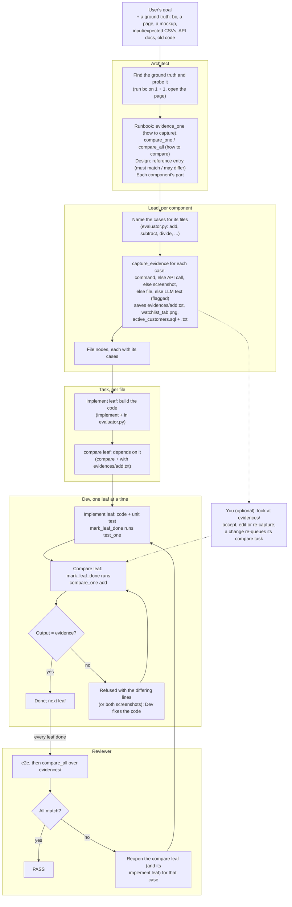
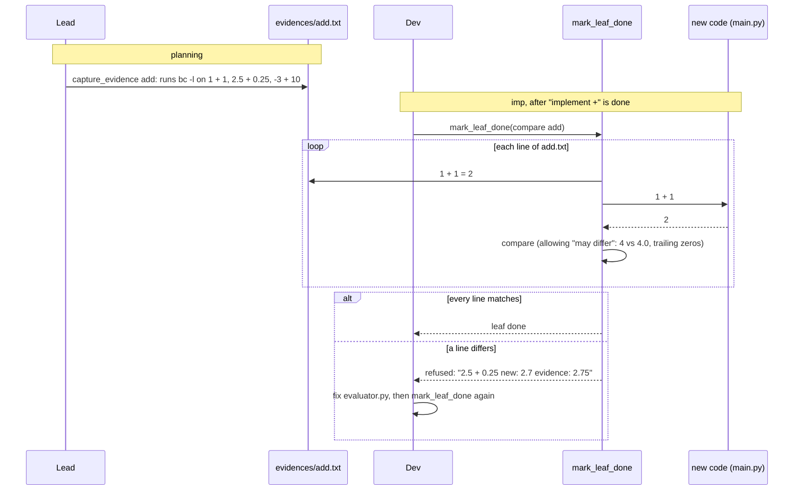

# Old vs new: evidence from a ground truth, checked by its own task

**Status:** proposal, for review. Nothing here is built yet.

## The idea

Many goals come with a **ground truth**: something the new code has to match.
It might be a command (`bc`), the original HTML page, a screenshot or mockup,
an input file with its expected output, API docs, or the old program being
replaced.

When a goal has one, each planning layer adds its own part, the way it already
plans the work:

1. **The Architect** adds to the runbook how to capture evidence from the
   ground truth and how to compare against it.
2. **The Lead** captures the **evidence** for its component: it runs the
   ground truth and saves what it gives in `evidences/`. That's a text file
   showing that `bc` says `1 + 1 = 2`, the API's response JSON, a SQL query
   with its result, or a screenshot of the original page. It comes from a
   command, an API call or a screenshot; text generated by the LLM is the
   last resort, and is labelled as such.
   **You can look at `evidences/`** and confirm it, edit it, or have it
   captured again, before or while the code is built.
3. **Task** creates the tasks from that evidence: one task builds the code
   (`implement add`), and the **next task compares** what it gives with the
   evidence (`compare add with evidences/add.txt`).
4. **Dev** does both tasks in order. The compare task is done only when the
   new code's output matches the evidence file.
5. **The reviewer** runs every comparison again at the end.

For the calculator, Lead (evaluator) runs `bc` and saves:

```
evidences/add.txt
# case add -- ground truth: bc -l (scale=10); captured by Lead (evaluator) with capture_evidence
1 + 1 = 2
2.5 + 0.25 = 2.75
-3 + 10 = 7
```

Task (evaluator.py) creates the two tasks:

| # | Task | Done when |
|---|---|---|
| 1 | implement `evaluate()` for + in `evaluator.py` | its unit test passes (as today) |
| 2 | compare `+` with `evidences/add.txt` (depends on 1) | every line of `add.txt` matches the new code's output |

Dev finishes task 1, then on task 2 `mark_leaf_done` runs the comparison:

```
compare add  (evidences/add.txt)
  1 + 1         new: 2         evidence: 2       match
  2.5 + 0.25    new: 2.75      evidence: 2.75    match
  -3 + 10       new: 7         evidence: 7       match
add: 3 of 3 match -- leaf done
```

or, when the code is wrong, refuses the task and says why:

```
compare add  (evidences/add.txt)
  2.5 + 0.25    new: 2.7       evidence: 2.75    MISMATCH
add: 1 of 3 differ -- leaf not done; fix evaluator.py and call mark_leaf_done again
```

A page works the same way. The Lead saves
`evidences/watchlist_tab.png` (the original after clicking Watchlist), and the
compare task screenshots the new page in the same state and puts the two side
by side.

## Why evidence files, and why a separate task

- **The evidence is fixed and reviewable.** It's captured once, by a tool,
  and saved in the project. You can open `evidences/` on GitHub and see what
  JFI decided the right answers are before any code exists. A live page that
  changes during the run, or a `bc` missing on the reviewer's machine,
  doesn't change it.
- **Nobody types the right answers.** `1 + 1 = 2` in `add.txt` came from
  running `bc`, not from the model. A hand-written expected value carries the
  same misunderstanding as the code, which is why today's unit tests (written
  by the same model) pass when a requirement was misread.
- **The comparison is visible in the plan.** "compare add with
  `evidences/add.txt`" is a task with its own status, time and result in
  `get_plan`, the dashboards and the review, instead of a hidden step inside
  another task.
- **Each task is checked right after it's built.** The compare task depends
  on the build task and runs next, so a wrong answer is caught on the task
  that caused it, not by the reviewer after many tasks were built on top of
  it.

## Where evidence comes from

`capture_evidence` tries the sources in this order and writes the one it
used in the file's header line, so anyone reading the file knows how much to
trust it:

| Order | Source | Example | Header |
|---|---|---|---|
| 1 | **A command** | `bc -l`, the old script, `sqlite3`, `psql` running a query | `source: command bc -l` |
| 2 | **An API call** | `GET /users/1` on the old service, or the request in the docs sent to a sandbox | `source: api GET https://old.example.com/users/1` |
| 3 | **A screenshot** | the original page, a live site, a mockup copied in | `source: screenshot file://.../portfolio-dashboard.html 1280x800` |
| 4 | **Copied from a file** | a slice of the expected CSV, a documented example | `source: file docs/api.md L40-58` |
| 5 | **Generated by the LLM** (last resort) | only when none of the above exists: e.g. "the answer the goal's own example implies" | `source: llm -- not verified; check this file` |

LLM-generated evidence is allowed so the run doesn't stop, but it's flagged
everywhere it shows up: in the file's header, in the dashboards (decision 10),
and in the review report, which lists the cases that were only checked
against generated evidence. It's the evidence you most need to look at.

## You check the evidence

The evidence is plain files in the project, written before any code is
built, so it's the easiest place to catch a wrong assumption:

- **Read it** on GitHub or in the project: `evidences/add.txt`,
  `evidences/watchlist_tab.png`, `evidences/active_customers.sql`.
- **Confirm or change it in the dashboard.** `jfi-web` (and the fleet
  dashboard) gets an Evidence list: every case, its file, its source, and
  whether its compare task has passed. For each one you can **accept** it,
  **edit** it (the header becomes `source: user`), or have it **captured
  again**.
- **A change goes back through the queue.** Editing or re-capturing a case's
  evidence re-queues its compare task, even one that already passed, so the
  code is checked against the corrected evidence. Editing the file by hand in
  the project has the same effect: the compare task reads the file when it
  runs, and the reviewer's `compare_all` reads it again at the end.

Whether a run waits for you to accept the evidence before building is
decision 11.

## What JFI does today

- The **Architect** records the stack, components, contracts and the runbook
  (`setup`, `run`, `view`, `test`, `test_one`, `e2e`, ...). Nothing records the
  ground truth or how to compare against it.
- **Lead and Task** see only their own node; nothing tells them what part of
  the original they rebuild.
- **Dev** finishes a task when its unit test passes, a test written by the
  same model from the same understanding.
- The **reviewer** checks that the build works (`e2e`, `check_page`,
  `browser`), not that it matches the original.
- The model has tried to record a comparison and had nowhere to put it. On
  the stui run (gemma) the Architect wrote `e2e = "Compare current view with
  portfolio-dashboard.html visually"`, which `runbook_set` refuses: it's a
  sentence, not a command.

## The flow



One compare task, for the calculator's `add` case:



## The user gives the input; JFI works out the rest

The user doesn't write a comparison spec. They name the ground truth, or
leave it in the project, in whatever form they have it:

| The user gives | Evidence the Lead captures (`evidences/`) |
|---|---|
| "Build a calculator. Compare it with `bc`." | `add.txt`, `divide.txt`, `divide_by_zero.txt`, ...: each input and what `bc -l` printed for it |
| "Turn `portfolio-dashboard.html` into a Vite app." | `header.png`, `watchlist_tab.png`, ...: the original screenshotted at the same viewport, one per state, with a `.json` beside each (URL, viewport, steps) |
| `input.csv` and `expected_output.csv` | `revenue.csv`, `month.csv`, ...: the expected file sliced per column, plus `full.csv` (the whole file) |
| A folder of PNG mockups, and "build this" | The mockups themselves, copied in as `login.png`, `home.png`, ..., with the viewport from each image's size |
| "Make it look like https://example.com/pricing." | `pricing.png`, the live page screenshotted once, so it doesn't change during the run |
| "Implement the API in `docs/api.md`." | `get_user.json`, `create_user_invalid.json`, ...: each documented request and its response |
| "Migrate the customers database from MySQL to Postgres." | `active_customers.sql` (the query), `active_customers.txt` (its result on the old database), and the same for row counts per table, totals, and a few spot-checked records |
| "Rewrite `legacy/report.sh` in Python." | `small.txt`, `unicode.txt`, ...: the old script's output for each sample input |
| "Same as the old one", with nothing named | First find it (a `legacy/`, `old/` or `v1/` folder, another implementation, the git history); ask if there's no candidate or more than one |

Before recording anything, the Architect:

1. **Finds the ground truth:** files and URLs the goal names; commands it
   names that are on PATH (`bc`, `jq`, `sqlite3`); reference-like files in
   the project.
2. **Works out what kind it is.** A page, an image or a design export is
   **visual**. A command, docs, a schema, an old program or a golden pair is
   **behavioural**.
3. **Probes it** with one or two real calls (run `bc` on `1 + 1`, open the
   page) to prove it works here and to see how it behaves.
4. **Decides what must match and what may differ.** `bc -l` prints
   `3.50000000000000000000` where Python prints `3.5`, `4` where Python prints
   `4.0`, truncates a fractional exponent with only a warning (`2 ^ 0.5`
   prints `1`), and words its errors its own way. Unless the goal says
   otherwise, those go under "may differ", or every comparison would fail on
   differences nobody cares about. (Checked with GNU `bc`.)
5. **Asks only when it can't work it out:** no ground truth where the goal
   clearly expects one, two candidates, a Figma link with no export, a page
   behind a login. Without an answer, it records its best guess as an
   assumption, and the reviewer reports those cases as *not checked*.

## Example: a data migration, checked with SQL

Goal: *"Migrate the shop's data from the old MySQL database to the new
Postgres one."* The ground truth is the old database, and the evidence is
**SQL queries run against it, saved with their results**:

```
evidences/active_customers.sql
-- case active_customers -- source: command mysql shop_old; captured by Lead (migration)
SELECT COUNT(*) AS active FROM customers WHERE status = 'active';

evidences/active_customers.txt
active
12408
```

```
evidences/order_totals.sql
-- case order_totals -- source: command mysql shop_old
SELECT DATE_FORMAT(created_at, '%Y-%m') AS month, SUM(total) AS revenue
FROM orders GROUP BY month ORDER BY month;

evidences/order_totals.txt
month    revenue
2026-01  48210.50
2026-02  51007.25
...
```

- The **Architect** records the old and new connections in the runbook and
  how to compare: `compare_one` runs `evidences/{case}.sql` against the new
  database and compares the result with `evidences/{case}.txt`. It also
  notes what may differ, such as SQL dialect (`DATE_FORMAT` vs `to_char`),
  where the Lead saves a second, Postgres version of the query.
- The **Lead** (migration component) picks the checks that prove the data
  arrived whole: a row count per table, totals that would change if a row
  were lost or doubled, and a few records looked up by id, including edge
  cases (NULLs, unicode names, the oldest and newest rows). It saves each
  query and lets `capture_evidence` run it on the old database for the
  result.
- **Task** adds, for each migration step, the step itself (`migrate the
  orders table`) and a compare task after it (`compare order_totals`).
- **Dev** runs the migration step; the compare task runs the saved query on
  the new database and must get the saved result.
- You can open `evidences/order_totals.sql`, see exactly what was checked,
  and run it yourself.

## The design, layer by layer

### Architect: the runbook and the guideline

The Architect records how to capture evidence and how to compare, and which
part of the ground truth each component covers. It doesn't name cases or
capture anything; that's the Lead's job, the same way the Architect names
components and leaves the files to the Lead.

```
design_set("reference", "bc",
  "The bc command (bc -l), the ground truth. Must match: each result to 10 decimal places; an "
  "error is one line, no traceback. May differ: 4 vs 4.0, trailing zeros, error wording, a "
  "fractional ^ (bc truncates it).")

runbook_set("evidence_dir", "evidences/",
  notes="Where the Lead saves the evidence, one file per case: <case>.txt, .png or .json.")
runbook_set("evidence_one", "bc -l <<< 'scale=10; {input}'",
  notes="How to get the ground truth's answer for one input. capture_evidence runs it.")
runbook_set("compare_one", "python3 scripts/compare_evidence.py {case}",
  notes="Runs every input in evidences/{case}.txt through `python3 main.py` and compares each "
        "answer with the evidence line; prints both and exits 1 on a mismatch.")
runbook_set("compare_all", "python3 scripts/compare_evidence.py --all")
```

and puts each component's part in its new `cases` field:
`evaluator: + - * / ^ and their errors`; `repl: the loop and exit`.
`scripts/compare_evidence.py` is code, so it's a node under the `project`
component like any other file.

For a page, the capture and the comparison are a tool, not a script:

```
runbook_set("evidence_one",
  "screenshot url=file://{project}/portfolio-dashboard.html viewport=1280x800 steps={input}")
runbook_set("compare_one", "compare_screens case={case}",
  notes="Screenshots the new app ({view}) in the state evidences/{case}.json describes and "
        "compares it with evidences/{case}.png.")
```

### Lead: the cases and their evidence

For its component, the Lead:

1. **Names the cases for each file**, within the component's part:
   `evaluator.py`: `add`, `subtract`, `multiply`, `divide`, `power`,
   `divide_by_zero`, `bad_input`.
2. **Chooses each case's inputs** (`add`: `1 + 1`, `2.5 + 0.25`, `-3 + 10`)
   and calls **`capture_evidence(case, inputs)`**. The tool runs the
   runbook's `evidence_one` for each input and writes `evidences/<case>.txt`
   (or `.png` + `.json`, or `.sql` + `.txt`), trying a command, an API call, a
   screenshot and a file before falling back to LLM-generated text (see
   "Where evidence comes from"). The Lead picks the inputs and never writes
   an answer itself.
3. **Adds the file nodes** as today, each with its case names in `cases`.

A part it can't cover with its files is an `escalate`, as today.

### Task: an implement leaf, then a compare leaf

For each file, Task adds its leaves as today (one per stub) and, for every
case on the file, a **compare leaf** after the leaf that builds it:

```
add_node("implement evaluate() for + in evaluator.py: ...", kind="implement",
         files=["evaluator.py", "tests/test_evaluator.py"], done_when="evaluate('1 + 1') == 2")
add_node("compare + with evidences/add.txt", kind="compare", cases=["add"],
         files=["evaluator.py"], depends_on=[<the implement leaf>],
         done_when="compare_one add: every line matches")
```

- The implement leaf's `done_when` test case comes from the evidence
  (`1 + 1` -> `2`, from `add.txt`), not from the model's own arithmetic.
- The compare leaf lists the source file, so Dev can fix the code in the same
  episode when the comparison fails.
- Every case on the file gets exactly one compare leaf. Task's `finish`
  checks that mechanically, as the node tools already check files and
  `depends_on`.

### Dev: the compare leaf's gate

A compare leaf has its own Dev prompt (`dev_prompt(kind)`, as `passage`
has) and gate:

1. `mark_leaf_done` runs `compare_one {case}` (or calls `compare_screens`
   for a visual case).
2. Every line or the screenshot pair matches: done. Otherwise it's refused
   with the differing lines (or both screenshots attached), and Dev fixes the
   code it lists and calls `mark_leaf_done` again. That counts against the
   leaf's attempts like a failing test.
3. A fix that belongs to another leaf's code: Dev says so with
   `add_reviewer_note`, and the reviewer reopens that leaf.

### Reviewer: everything again

After `e2e`, the reviewer runs `compare_all` over `evidences/`. A failing
case points at its compare leaf, which it reopens (with its implement leaf
when the code is wrong at its root). A case that can't run here (no
browser) goes in the review report as *not checked*, never as passed.

### Two kinds of evidence and comparison

| | Behavioural | Visual |
|---|---|---|
| Ground truth | A command, docs, an old program, a golden file | A page, a mockup, a design export |
| Evidence file | `evidences/<case>.txt` or `.json`: each input and the ground truth's answer | `evidences/<case>.png`, plus `<case>.json` (URL, viewport, steps) |
| Captured by | `capture_evidence` running `evidence_one` | `capture_evidence` screenshotting the original (or copying the mockup) |
| Compared by | `compare_one`: a script; exit code is the answer | `compare_screens`: the new app in the same state; the model judges the pair |

`compare_screens` is built from `check_page`'s headless browser (Playwright)
and `view_image`'s attachment. It saves `new.png` and a pixel `diff.png`
beside the evidence under `.jfi/screens/compare/<case>/`, and returns the
share of pixels that differ, a diff of the visible text and both screenshots
attached. It doesn't decide pass or fail on its own (decision 4).

## Kinds of ground truth

| Ground truth | New code | One case's evidence | Kind |
|---|---|---|---|
| A command (`bc`, `jq`, `sqlite3`) | A program or function | The command's answer for each input | behavioural |
| Input and expected output files (CSV, JSON, text) | A pipeline or script | A slice of the expected file (one column, or the whole) | behavioural |
| Old implementation, in any language | The rewrite | The old program's output for each input | behavioural |
| The old implementation's tests | The rewrite | One old test and its result | behavioural |
| API docs (Markdown, OpenAPI) | A service | One documented request and response | behavioural |
| GraphQL schema, `.proto`, JSON Schema | A service or file output | The schema slice an operation or file must satisfy | behavioural |
| Recorded traffic (HAR, request logs) | A service | One recorded request and response | behavioural |
| A CLI's `--help`, man page, terminal transcripts | A CLI | One recorded command and its output | behavioural |
| A spreadsheet's formulas | Code | One sheet's inputs and computed values | behavioural |
| A database schema or dump | ORM models, migrations | One table's dumped schema | behavioural |
| An old database (a data migration) | The migrated database | A SQL query (`.sql`) and its result on the old database (`.txt`) | behavioural |
| A build config (webpack, `setup.py`) | The migrated build | One output's listing (pages, entry points, package files) | behavioural |
| An HTML page or prototype | A web app | One state's screenshot | visual |
| A mockup, screenshot or wireframe photo | A web app | The image (a wireframe: layout only) | visual |
| A Figma design | A web app | One frame, as a PNG export (decision 6) | visual |
| A live website | The rebuilt site | One page's screenshot, taken once | visual |
| Mobile mockups, breakpoints | A responsive app | One screen at one width | visual |
| A chart image (Excel, matplotlib) | A dashboard chart | The chart image | visual |
| A PDF layout (invoice, report) | Generated output | One page, rendered to PNG | visual |
| HTML email templates | New templates | One email at client width | visual |
| Storybook / design-system screenshots | New components | One component state | visual |
| A screen recording or GIF | An interaction | One step's frame (`extract_video_frames`) | visual |
| A screenshot of an old terminal UI | A prompt_toolkit TUI | Out of scope for now: no headless TUI capture | -- |

## The benchmark tasks, each with a ground truth

Every task in `benchmark/tasks/` has a ground truth its goal could name.
Variants that name it are how the feature gets measured (Build notes).

| Task | Ground truth | Evidence for one case |
|---|---|---|
| `terminal/calc` | `bc -l` | `evidences/add.txt`: inputs and `bc`'s answers |
| `data_engineering/log_pipeline` | `grep` / `awk` / `sort \| uniq -c` over the same log | One output key's value, as the shell pipeline gives it |
| `data_engineering/sales_summary` | An expected-output file, or `sqlite3` with `SUM(quantity*unit_price) ... GROUP BY region` | One summary value |
| `polyglot/*` | The other language's twin (`_js` vs Python) | The twin's output for each input |
| `polyglot/collatz_conjecture` | OEIS A006577 (the step counts for n = 1, 2, 3, ...) | The published values for one range of n |
| `polyglot/difference_of_squares` | The closed forms, (n(n+1)/2)² and n(n+1)(2n+1)/6, in `bc` | `bc`'s values for one function over n = 1..1,000 |
| `polyglot/run_length_encoding` | A one-line `itertools.groupby` encoder | Its output for each string |
| `polyglot/spiral_matrix` | The spiral printed in the goal (n = 4), or the twin | One n's matrix |
| `html/pricing_table`, `recipe_card`, `faq_accordion` | A mockup PNG shipped with the task | The mockup at 1280 px (the FAQ also with one item open) |
| `webapp/react_counter` | A plain-JS counter page | Its screenshot before, and after 3 clicks |
| `webapp/nextjs_static` | A two-page static HTML version | One page's screenshot, plus the nav link followed |
| `webapp/music_player` | `music/library.json` and the WAV files | One song's title, artist and duration (the WAV's real length) |
| `story/*` | A sample passage in the wanted format (e.g. the `NARATOR:` / `CHAR_1:` script format in TODO item 10) | The sample's structure; the tone is the reviewer's read |

## Decisions to review

1. **Where the evidence lives.** *Proposal:* `evidences/` in the project, kept
   and committed, so it can be reviewed on GitHub. Cleanup never deletes it.
   The comparison's own output (`new.png`, `diff.png`) is scratch and goes
   under `.jfi/`.
2. **A compare task after each implement task** (rather than a check inside
   the implement task's `mark_leaf_done`). *Proposal:* yes, as above. It
   needs one exception to the planner's rule that "running the tests or
   checking that it all works is never a node" (`planner/prompts.py`
   `RULES`): a `compare` leaf is allowed when it names a case whose evidence
   file exists. That rule exists because "run the tests" nodes had nothing to
   build and no way to fail; a compare leaf has both.
3. **When it's required.** *Proposal:* the Architect's `finish` requires
   `evidence_one`, `compare_one` and `compare_all` only when the goal names a
   ground truth: a file in the project with a `.html`, `.png`, `.jpg`,
   `.svg`, `.pdf`, OpenAPI `.yaml`/`.json` or docs `.md` extension; an
   input/expected pair; a command it names that's on PATH; or a Figma URL.
   That's a mechanical check, like `entry`.
4. **Pass or fail on screenshots.** A pixel threshold is brittle: fonts,
   anti-aliasing and sample data all differ. *Proposal:* the model judges the
   attached pair against "must match / may differ"; the pixel share and text
   diff are evidence, and a large text diff (a missing heading or card) is
   flagged as missing work.
5. **States beyond the first screen** (tabs, dialogs, scrolled sections).
   *Proposal:* steps as a short list of `browser`-style actions (`click
   <text>`, `type <field> <text>`, `scroll`), saved in the case's `.json` and
   replayed the same way on the new app.
6. **Figma.** Exporting frames from a Figma URL needs an API token.
   *Proposal:* not at first. The goal supplies PNG exports (or the Architect
   asks for them). A `FIGMA_TOKEN` export can come later.
7. **Who picks the inputs.** *Proposal:* the Lead, who sees its component's
   part; the ground truth gives every answer through `capture_evidence`.
   Where the ground truth already is a list of answers (an expected CSV,
   documented examples), the Lead slices or copies it into the evidence
   files.
8. **New tools for the Architect and the Lead.** Neither can run a command or
   open a page today (`episode/roles.py`). *Proposal:* the Architect gets
   `execute_command` for read-only probes; the Lead gets `capture_evidence`,
   which only runs the runbook's `evidence_one` (or screenshots the original)
   and writes under `evidences/`, so it can't change anything else.
9. **Asking the user (the Architect).** No model-facing tool asks the user anything today:
   the console asks for the goal at the start, and `!` interjections reach
   whichever episode reads them first. *Proposal:* a narrow `ask_user` for
   the Architect only, one question per run, offering the candidates it
   found. With no answer (or `AUTO_APPROVE_COMMANDS`, meaning nobody is
   watching), it goes on with its best guess, recorded as an assumption.

10. **LLM-generated evidence.** *Proposal:* allowed only after a command, an
    API call, a screenshot and a file have all been ruled out; labelled
    `source: llm -- not verified` in the file, marked in the dashboards, and
    listed in the review report. A run whose evidence is all LLM-generated
    says so in its result.
11. **Waiting for you.** *Proposal:* by default the run doesn't wait: Dev
    starts while the evidence is open for you to check, and a change you make
    re-queues the affected compare tasks. `EVIDENCE_REVIEW=1` in `.env` makes
    the run pause after planning until you accept the evidence in the
    dashboard (or the terminal), for runs where a wrong ground truth would
    waste hours.

## Build notes (once agreed)

- `tool/design_tools.py`: `KINDS` gains `reference`.
- `tool/runbook_tools.py`: `evidence_one`, `compare_one` and `compare_all`
  join `COMMAND_ENTRIES`; `_starts_with_a_program` accepts `screenshot` and
  `compare_screens`; `{input}`, `{case}`, `{project}` and `{view}` are
  filled in by the tools that run them.
- `tool/evidence_tools.py`: `capture_evidence(case, inputs)`, which runs
  `evidence_one` per input (or screenshots the original with the case's
  steps, or runs the case's `.sql`) and writes `evidences/<case>.*` with a
  `source:` header line, falling back in the order of "Where evidence comes
  from"; and `compare_screens`, from `check_page`'s Playwright code and
  `view_image`'s attachment.
- `episode/roles.py`: `capture_evidence` in the Lead's core set;
  `execute_command` for the Architect; `compare_screens` for Dev (compare
  leaves) and the reviewer.
- `planner/nodes.py`: `KINDS` gains `compare`; a compare leaf needs a case
  whose evidence file exists and a `depends_on`; a split keeps every case.
  `models/leaf.py`: a `cases` column, plus `_ensure_columns`.
- `planner/prompts.py`: the Architect's runbook and guideline; the Lead's
  cases and `capture_evidence`; Task's compare leaves, and implement leaves'
  `done_when` from the evidence; the `RULES` exception (decision 2).
  `planner/loop.py`: each layer's `finish` check (Architect: the runbook
  entries; Lead: every case of a component with a part has its evidence file;
  Task: every case of the file has one compare leaf).
- `imp/prompts.py` and `imp/dev.py`: the compare leaf's prompt and gate.
- `review/prompts.py`: `compare_all` after `e2e`, and the list of cases
  checked only against LLM-generated evidence. Cleanup: leave `evidences/`
  alone.
- `web/dashboard.py` and `manager/web_bridge.py`: the Evidence list (each
  case, file, source, compare status) with accept / edit / re-capture; a
  change re-queues the case's compare leaf. The fleet dashboard
  (`Just-Finish-It-Fleet`) mirrors it. `EVIDENCE_REVIEW` in
  `JFI_ENV_TEMPLATE`.
- Tests:
  - a goal naming an HTML file refuses the Architect's `finish` without the
    runbook entries;
  - `capture_evidence` with a real `bc` writes `add.txt` with `1 + 1 = 2` and
    `source: command bc -l`; with no command, API, page or file it writes
    `source: llm -- not verified`;
  - a `.sql` case run against two SQLite databases (old and migrated)
    matches, and fails after a row is deleted from the new one;
  - editing an evidence file re-queues a compare leaf that had passed;
  - a Task whose file has a case with no compare leaf is refused;
  - a compare leaf whose output differs from its evidence is refused by
    `mark_leaf_done`, and one that matches is accepted;
  - `compare_screens` on two local `file://` pages returns both images and a
    diff.
- Docs: `phase-planner.md`, `phase-imp.md`, `phase-reviewer.md`,
  `plan-tree.md` (the `compare` kind, the `cases` field, `evidences/`).
- Benchmarks: a variant of each task whose goal names its ground truth (calc
  with `bc` and `sales_summary` with an expected-output CSV first). The
  harness checks that `evidences/` was captured, that every compare leaf
  passed, and that the reviewer ran `compare_all`, alongside the task's own
  `verify`.
